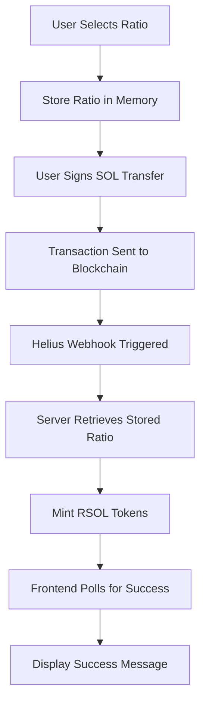
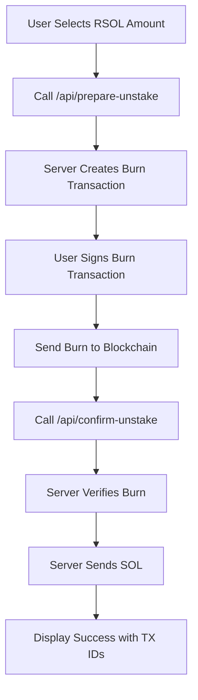

# RSOL - Centralized Liquid Staking Platform

A comprehensive centralized liquid staking token (LST) platform for Solana devnet that provides flexible ratio-based staking and unstaking with automated token management.

## 🎯 What is This Platform?

This is a **full-stack decentralized finance (DeFi) application** that allows users to:

1. **Stake SOL** and receive **RSOL tokens** at customizable ratios
2. **Unstake RSOL** and receive **SOL back** based on selected conversion rates
3. **Monitor transactions** in real-time with webhook integration
4. **Flexible ratio system** - choose conservative (1:1) to aggressive (2:1) conversion rates

### 🔄 Platform Flow

```
User Staking Flow:
SOL → [Ratio Selection] → [Webhook Processing] → RSOL Tokens

User Unstaking Flow:
RSOL → [Burn Transaction] → [Server Verification] → SOL Transfer
```

## 🏗️ Architecture Overview

### Frontend (Client-Side)
- **Next.js 15** with App Router
- **React 19** with hooks and modern patterns
- **TypeScript** for type safety
- **Tailwind CSS** for responsive design
- **Solana Wallet Adapter** for wallet integration

### Backend (Server-Side)
- **Next.js API Routes** for serverless functions
- **Solana Web3.js** for blockchain interactions
- **SPL Token (Token-2022)** for advanced token operations
- **Helius Webhooks** for real-time transaction monitoring
- **In-memory store** for temporary request management

### Blockchain Layer
- **Solana Devnet** for testing and development
- **Token-2022 Program** for enhanced token features
- **System Program** for SOL transfers
- **Memo Program** for transaction uniqueness

## 🚀 Key Features

### ✅ Flexible Ratio Staking
- **Dynamic Ratios**: 1.0x (conservative) to 2.0x (aggressive)
- **Real-time Calculation**: See expected RSOL before staking
- **Customizable Returns**: Higher ratios = more RSOL tokens

### ✅ Two-Step Secure Unstaking
- **User Signs Burn**: Users sign their own token burn transactions
- **Server Verification**: Backend verifies burn before SOL transfer
- **Ratio-Based Returns**: SOL returned based on unstaking ratio selected

### ✅ Real-Time Transaction Monitoring
- **Webhook Integration**: Automatic detection of SOL transfers
- **Live Updates**: Frontend polls for minting status
- **Transaction Logging**: Complete audit trail of all operations

### ✅ Advanced Transaction Management
- **Unique Transaction IDs**: Memo instructions prevent duplicate transactions
- **Cache-Busting**: Advanced RPC options to avoid "already processed" errors
- **Retry Logic**: Automatic retry with exponential backoff

## 📁 Project Structure

```
lst-centralized-platform/
├── app/                          # Next.js App Router
│   ├── api/                      # Backend API Routes
│   │   ├── webhook/             # Helius webhook handler
│   │   ├── stake-request/       # Store staking ratios
│   │   ├── prepare-unstake/     # Prepare burn transactions
│   │   ├── confirm-unstake/     # Verify and send SOL
│   │   ├── rsol-balance/        # Check RSOL balances
│   │   └── webhook-events/      # Transaction monitoring
│   ├── components/              # React Components
│   │   ├── Navigation.tsx       # Header navigation
│   │   ├── SOL_to_RSOL.tsx     # Staking ratio selector
│   │   └── RSOL_to_SOL.tsx     # Unstaking ratio selector
│   ├── lib/                     # Utility Libraries
│   │   ├── stakeStore.ts        # In-memory request store
│   │   └── webhookStore.ts      # Webhook event storage
│   ├── LST/                     # Staking Page
│   │   └── page.tsx             # Main staking interface
│   ├── unstake/                 # Unstaking Page
│   │   └── page.tsx             # Unstaking interface
│   ├── monitor/                 # Monitoring Dashboard
│   │   └── page.tsx             # Real-time transaction monitor
│   └── layout.tsx               # Root layout with wallet providers
├── public/                      # Static assets
└── package.json                 # Dependencies and scripts
```

## 🔌 API Endpoints

### Client-Side Routes

| Route | Purpose | Description |
|-------|---------|-------------|
| `/` | Home Page | Landing page with platform overview |
| `/LST` | Staking Interface | Stake SOL → Receive RSOL |
| `/unstake` | Unstaking Interface | Burn RSOL → Receive SOL |
| `/monitor` | Transaction Monitor | Real-time webhook events |

### Backend API Routes

| Endpoint | Method | Purpose | Client/Server |
|----------|--------|---------|---------------|
| `/api/webhook` | POST | Helius webhook receiver | **Server** |
| `/api/stake-request` | POST | Store staking ratios | **Client → Server** |
| `/api/prepare-unstake` | POST | Create burn transactions | **Client → Server** |
| `/api/confirm-unstake` | POST | Verify burn & send SOL | **Client → Server** |
| `/api/rsol-balance` | GET | Check user RSOL balance | **Client → Server** |
| `/api/webhook-events` | GET | Get transaction events | **Client → Server** |

## 🔄 Request Flow Diagrams

### Staking Flow


### Unstaking Flow


## 🛠️ Technical Implementation

### Staking Process (Client-Side → Server-Side)

1. **Client**: User adjusts ratio slider on `/LST` page
2. **Client**: Calls `/api/stake-request` to store ratio
3. **Client**: Signs SOL transfer transaction with unique memo
4. **Server**: Helius webhook receives transaction notification
5. **Server**: Retrieves stored ratio from memory
6. **Server**: Mints RSOL tokens using Token-2022 program
7. **Client**: Polls `/api/webhook-events` for completion status

### Unstaking Process (Client-Side ↔ Server-Side)

1. **Client**: User selects RSOL amount on `/unstake` page
2. **Client**: Calls `/api/prepare-unstake` with burn details
3. **Server**: Creates burn transaction with fresh blockhash
4. **Client**: User signs burn transaction
5. **Client**: Sends burn transaction to blockchain
6. **Client**: Calls `/api/confirm-unstake` with burn signature
7. **Server**: Verifies burn transaction completed
8. **Server**: Sends SOL from platform wallet to user

### Real-Time Monitoring (Server-Side → Client-Side)

1. **Server**: Webhook events stored in memory
2. **Client**: Monitor page polls `/api/webhook-events`
3. **Client**: Displays live transaction feed
4. **Client**: Shows processing status and completion times

## 🔐 Security Features

### Transaction Security
- **User Signatures**: Users sign their own burn transactions
- **Server Verification**: Backend verifies all burns before SOL transfer
- **Unique Memos**: Prevent transaction replay attacks
- **Fresh Blockhashes**: Avoid "already processed" errors

### Data Security
- **Environment Variables**: Sensitive data in server environment only
- **Private Key Management**: Platform wallet keys secured server-side
- **No Client Secrets**: Zero sensitive data exposed to frontend

### Blockchain Security
- **Token-2022**: Advanced token program with enhanced security
- **Devnet Only**: Safe testing environment
- **Transaction Logging**: Complete audit trail

## 📊 Advanced Features

### Ratio Management System
```typescript
// Conservative to Aggressive ratio selection
const ratioOptions = {
  conservative: 1.0,  // 1 SOL → 1 RSOL
  moderate: 1.5,      // 1 SOL → 1.5 RSOL
  aggressive: 2.0     // 1 SOL → 2 RSOL
}
```

### Transaction Uniqueness
```typescript
// Unique memo generation
const memo = `stake-${timestamp}-${randomId}-${blockhash}`
```

### Cache-Busting RPC Options
```typescript
const txOptions = {
  skipPreflight: true,
  preflightCommitment: 'finalized',
  maxRetries: 5
}
```

## 🚀 Setup Instructions

### Prerequisites

- **Node.js 18+** - JavaScript runtime
- **Solana Wallet** - Phantom, Solflare, etc.
- **Devnet SOL** - For testing transactions
- **Helius Account** - For webhook integration
- **Alchemy Account** - For RPC endpoints

### Environment Variables

Create a `.env.local` file in the root directory:

```env
# Solana RPC Endpoint
NEXT_PUBLIC_ALCHEMY_DEVNET_ENDPOINT=https://solana-devnet.g.alchemy.com/v2/YOUR_API_KEY

# Platform Wallet Configuration
WALLET_PUBLIC_KEY=YOUR_PLATFORM_WALLET_PUBLIC_KEY
NEXT_PUBLIC_WALLET_PUBLIC_KEY=YOUR_PLATFORM_WALLET_PUBLIC_KEY
WALLET_PRIVATE_KEY=YOUR_PLATFORM_WALLET_PRIVATE_KEY_BASE58

# RSOL Token Configuration
TOKEN_MINT_ADDRESS=YOUR_RSOL_TOKEN_MINT_ADDRESS

# Application URL
NEXT_PUBLIC_BASE_URL=http://localhost:3000
```

### Installation & Development

1. **Clone the repository**:
   ```bash
   git clone <repository-url>
   cd lst-centralized-platform
   ```

2. **Install dependencies**:
   ```bash
   npm install
   ```

3. **Set up environment variables**:
   ```bash
   cp .env.example .env.local
   # Edit .env.local with your configuration
   ```

4. **Run the development server**:
   ```bash
   npm run dev
   ```

5. **Open your browser**:
   Navigate to `http://localhost:3000`

## 🔧 Configuration Guide

### 1. Create RSOL Token Mint

```bash
# Use Solana CLI to create token mint
spl-token create-token --decimals 9
# Copy the mint address to TOKEN_MINT_ADDRESS
```

### 2. Set Up Platform Wallet

```bash
# Generate new keypair for platform wallet
solana-keygen new --outfile platform-wallet.json
# Export private key in base58 format for WALLET_PRIVATE_KEY
```

### 3. Configure Helius Webhook

1. **Create webhook** at [helius.dev](https://helius.dev)
2. **Set webhook URL**: `https://yourdomain.com/api/webhook`
3. **Monitor addresses**: Add your platform wallet address
4. **Transaction types**: Enable "TRANSFER" events
5. **Test webhook**: Send test transaction

### 4. Set Up Alchemy RPC

1. **Create account** at [alchemy.com](https://alchemy.com)
2. **Create Solana app** for devnet
3. **Copy RPC URL** to `NEXT_PUBLIC_ALCHEMY_DEVNET_ENDPOINT`

## 🧪 Testing Guide

### Local Testing

1. **Test Wallet Connection**:
   ```bash
   # Ensure wallet is on devnet
   # Check wallet has devnet SOL
   ```

2. **Test Staking Flow**:
   - Navigate to `/LST`
   - Connect wallet
   - Select ratio (start with 1.0x)
   - Stake small amount (0.1 SOL)
   - Monitor webhook events on `/monitor`

3. **Test Unstaking Flow**:
   - Navigate to `/unstake`
   - Check RSOL balance
   - Select unstaking amount
   - Complete two-step process
   - Verify SOL received

### API Testing

```bash
# Test webhook endpoint
curl -X POST http://localhost:3000/api/webhook \
  -H "Content-Type: application/json" \
  -d @sample-webhook.json

# Test balance endpoint
curl "http://localhost:3000/api/rsol-balance?wallet=YOUR_WALLET_ADDRESS"

# Test webhook events
curl "http://localhost:3000/api/webhook-events"
```

## 🚀 Production Deployment

### Deploy to Vercel

1. **Build the application**:
   ```bash
   npm run build
   ```

2. **Deploy to Vercel**:
   ```bash
   npx vercel --prod
   ```

3. **Set environment variables**:
   - Add all `.env.local` variables to Vercel dashboard
   - Update `NEXT_PUBLIC_BASE_URL` to production URL

4. **Update webhook URL**:
   - Change Helius webhook to `https://yourdomain.com/api/webhook`
   - Test with small transactions

### Deploy to Other Platforms

**Netlify**:
```bash
npm run build
# Deploy dist folder to Netlify
```

**Railway**:
```bash
# Connect GitHub repository to Railway
# Set environment variables in Railway dashboard
```

## 🛡️ Security Best Practices

### Environment Security
- ✅ **Never commit** `.env.local` to git
- ✅ **Use different wallets** for dev/prod
- ✅ **Rotate private keys** regularly
- ✅ **Monitor platform wallet** for unauthorized access

### Transaction Security
- ✅ **Validate all inputs** on server-side
- ✅ **Verify transaction signatures** before processing
- ✅ **Implement rate limiting** on API endpoints
- ✅ **Log all transactions** for audit trail

### Webhook Security
- ✅ **Validate webhook signatures** (if provided by Helius)
- ✅ **Implement IP whitelist** for webhook endpoint
- ✅ **Add request size limits** to prevent DoS
- ✅ **Monitor webhook errors** and failures

## 🐛 Troubleshooting

### Common Issues

**1. Wallet Connection Failed**
```bash
# Solution:
- Ensure wallet is set to devnet
- Clear browser cache and cookies
- Try different wallet adapter
- Check wallet permissions
```

**2. Transaction Already Processed**
```bash
# Solution:
- Wait 30 seconds between transactions
- Use different SOL amounts
- Clear browser cache
- Restart wallet extension
```

**3. RSOL Tokens Not Minted**
```bash
# Debug steps:
1. Check webhook logs in /monitor page
2. Verify webhook URL is correct
3. Check platform wallet has mint authority
4. Ensure TOKEN_MINT_ADDRESS is correct
5. Check Helius webhook configuration
```

**4. Unstaking Failed**
```bash
# Debug steps:
1. Check RSOL balance is sufficient
2. Verify burn transaction succeeded
3. Check platform wallet has SOL
4. Review transaction signatures
```

### Debug Commands

```bash
# Check Solana cluster
solana config get

# Check wallet balance
solana balance YOUR_WALLET_ADDRESS

# Check token accounts
spl-token accounts

# View transaction details
solana confirm TRANSACTION_SIGNATURE
```

### Logging & Monitoring

```bash
# Enable debug logging
NODE_ENV=development npm run dev

# Monitor webhook events
# Visit /monitor page for real-time events

# Check browser console for detailed logs
# Client-side errors appear in browser console
# Server-side errors appear in terminal
```

## 📈 Performance Optimization

### Frontend Optimization
- **React Memoization**: Components memoized for better performance
- **Lazy Loading**: Dynamic imports for large dependencies
- **State Management**: Optimized re-renders with proper state structure

### Backend Optimization
- **Connection Pooling**: Reuse Solana RPC connections
- **Memory Management**: Clean up old webhook events and stake requests
- **Error Handling**: Graceful degradation for RPC failures

### Blockchain Optimization
- **Fresh Blockhashes**: Prevent transaction conflicts
- **Optimal Commitment**: Use appropriate commitment levels
- **Retry Logic**: Handle network congestion gracefully

## 🤝 Contributing

We welcome contributions to improve the RSOL platform! Here's how to get started:

### Development Process

1. **Fork the repository**
2. **Create a feature branch**:
   ```bash
   git checkout -b feature/your-feature-name
   ```
3. **Make your changes**
4. **Test thoroughly**:
   ```bash
   npm run test
   npm run build
   ```
5. **Submit a pull request**

### Code Standards

- **TypeScript**: All new code must be TypeScript
- **ESLint**: Follow existing linting rules
- **Comments**: Document complex logic and API endpoints
- **Testing**: Add tests for new features

### Areas for Contribution

- 🔐 **Enhanced Security**: Webhook signature validation
- 📊 **Analytics**: Transaction analytics dashboard  
- 🎨 **UI/UX**: Improved user interface
- ⚡ **Performance**: Caching and optimization
- 🧪 **Testing**: Unit and integration tests
- 📖 **Documentation**: API documentation and guides

## 📋 Roadmap

### Phase 1: Core Platform ✅
- [x] Basic staking/unstaking functionality
- [x] Webhook integration
- [x] Ratio-based conversions
- [x] Transaction monitoring

### Phase 2: Enhanced Features 🚧
- [ ] Reward distribution system
- [ ] Governance token integration
- [ ] Advanced analytics dashboard
- [ ] Mobile-responsive improvements

### Phase 3: Advanced Features 🔮
- [ ] Multi-token support
- [ ] Cross-chain bridging
- [ ] Automated rebalancing
- [ ] Yield farming integration

## 📚 Additional Resources

### Solana Development
- [Solana Docs](https://docs.solana.com/)
- [SPL Token Guide](https://spl.solana.com/token)
- [Token-2022 Documentation](https://spl.solana.com/token-2022)

### Wallet Integration
- [Wallet Adapter Guide](https://github.com/solana-labs/wallet-adapter)
- [Phantom Developer Docs](https://docs.phantom.app/)

### Webhook Services
- [Helius Documentation](https://docs.helius.dev/)
- [Webhook Best Practices](https://webhook.site/best-practices)

### Next.js Resources
- [Next.js 15 Documentation](https://nextjs.org/docs)
- [App Router Guide](https://nextjs.org/docs/app)

## 🙏 Acknowledgments

- **Solana Foundation** - For the robust blockchain infrastructure
- **Helius** - For reliable webhook services
- **Alchemy** - For high-performance RPC endpoints
- **Vercel** - For seamless deployment platform

## 📄 License

This project is licensed under the MIT License - see the [LICENSE](LICENSE) file for details.

## 🆘 Support & Community

### Get Help

- **GitHub Issues**: Report bugs and request features
- **Discord**: Join our community server
- **Documentation**: Check this README and inline comments
- **Email**: Contact the development team

### Quick Links

- 🌐 **Live Demo**: [https://lst-sample.rahullalwani.com](https://lst-sample.rahullalwani.com)
- 📖 **Documentation**: This README
- 🐛 **Bug Reports**: GitHub Issues
- 💡 **Feature Requests**: GitHub Discussions

---

**Built with ❤️ for the Solana ecosystem**

*Last updated: August 2025*
